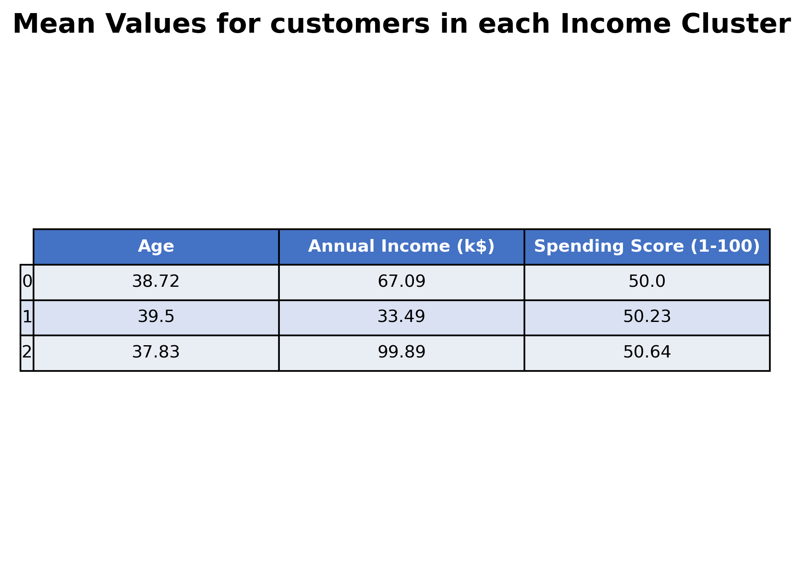
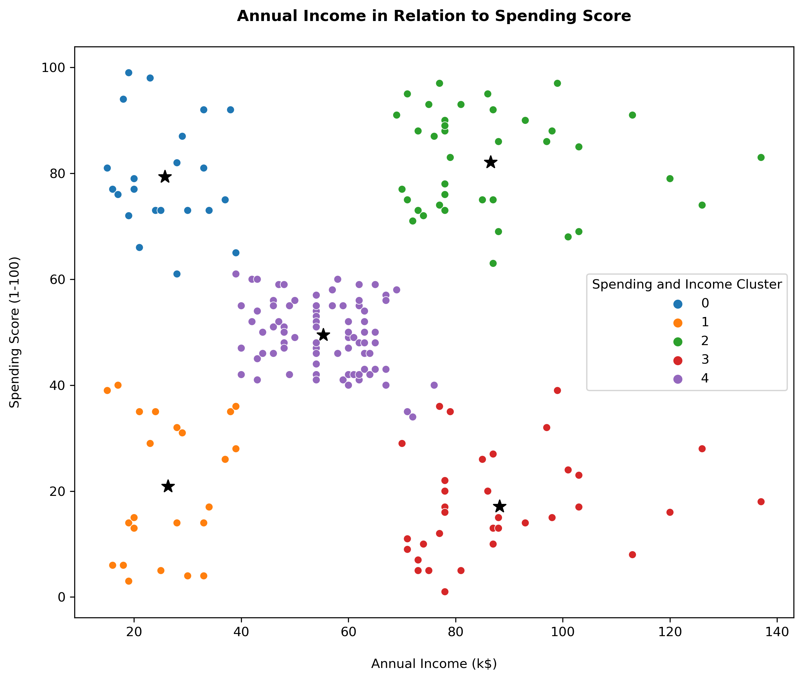

# Shopping mall customer segmentation: Project overview

## Summary
This projects examines a data set of customer data from visitors to a shopping mall. The purpuose is to identify which customer segment that is best for the mall to target with marketing efforts.
The project covered the following:
* Exploratory univariate and bivariate analysis of the data
* Univariate, bivariate and multivariate clustering, using the unsuprivised machine learning algorithm k-means, to identify the most relevant customer segment
* Analysis to understand the caracteristics of the identified segment

The main conclusion is that the most relevant customer segment contains customers with a high income as well as high spending. The customers in the segment are on average 33 years old and the segment comprises of slightly more females than males. The mall should therefore prioritize this segment during marketing efforts.

## Code and resources used
**Python Version:** 3.11.5  
**Packages:** Pandas, Seaborn, Matplotlib, Sklearn

## Data
The analysis has been conducted using a dataset from Kaggle available [here](https://www.kaggle.com/datasets/vjchoudhary7/customer-segmentation-tutorial-in-python).
The datasets include the columns listed below
* CustomerID
* Gender
* Age
* Annual Income
* Spending Score (A score assigned by the mall based on customer behavior and spending nature)

## Exploratory Data Analysis
Below are some of the highlights from the exploratory analysis  
  
  

 

## Clustering
First, a univariate clustering based on annual income was conducted. This resulted in the clusters below:  

  

In a second step, bivariate clustering was conducted based on annual income and spending score. The result was 5 different clusters as can be seen below.  

  

As a final step, a multivariate clustering was conducted with the results shown below.

  

  
